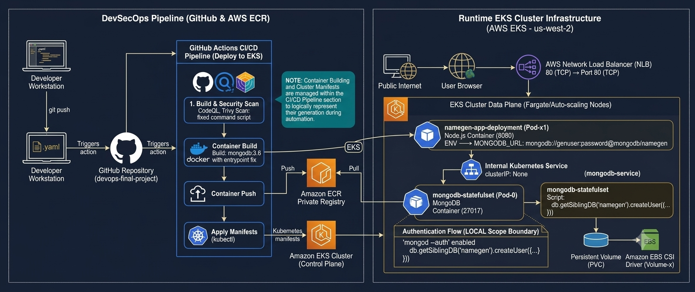
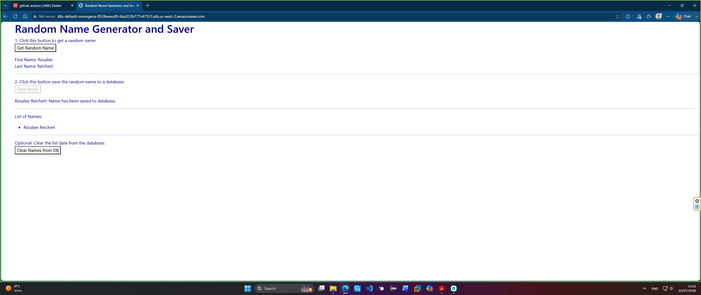

<div align="center">

# 🚀 NameGen DevOps Project

### Automated delivery of a Node.js and MongoDB application to Amazon EKS


**Build → Push → Deploy → Expose**

</div>

---

## 📌 Overview

**NameGen** is a random-name generator and saver deployed on **Amazon EKS Auto Mode**.

The application is built with Node.js and Express, packaged as a Docker image, stored in Amazon ECR, and deployed to Kubernetes through GitHub Actions. An AWS Network Load Balancer exposes the application, while MongoDB runs inside the cluster as a StatefulSet.

Users can:

- Generate random first and last names
- Save names to MongoDB
- View all saved names
- Delete all stored names

---

## 🏗️ Architecture



```text
Developer → GitHub Actions → Docker Build → Amazon ECR → Amazon EKS
                                                              │
User → AWS Network Load Balancer → NameGen Pod → MongoDB Service
                                                     │
                                              MongoDB StatefulSet
```

---

## 🧰 Technology Stack

| Category | Technology |
|---|---|
| Cloud | AWS EKS, ECR and Network Load Balancer |
| Application | Node.js 18, Express and Faker |
| Database | MongoDB 3.6 and Mongoose |
| Containers | Docker |
| Orchestration | Kubernetes |
| CI/CD | GitHub Actions |
| Provisioning | eksctl |
| Testing | Mocha and Chai |
| Logging | Winston |

---

## 🔄 CI/CD Pipeline

Every push to the `main` branch triggers `.github/workflows/main.yml`.

1. Checks out the repository
2. Authenticates to AWS
3. Logs in to Amazon ECR
4. Builds the Docker image
5. Tags it with the Git commit SHA
6. Pushes it to the `namegen` ECR repository
7. Connects to the `devops-project` EKS cluster
8. Applies the MongoDB and application manifests
9. Prints the public LoadBalancer endpoint

This creates a traceable deployment because every image is tied to a specific Git commit.

---

## ☸️ Kubernetes Components

| Component | Purpose |
|---|---|
| `namegen-app-deployment` | Runs the Node.js application on port `8080` |
| `namegen-app-service` | Exposes the application on port `80` through an internet-facing NLB |
| `mongodb` Service | Provides internal database discovery on port `27017` |
| `mongodb` StatefulSet | Runs the MongoDB container |
| `mongodb-pvc` | Requests `5Gi` of storage |

---

## 📂 Project Structure

```text
.github/workflows/     GitHub Actions CI/CD pipeline
ekscluster/            EKS Auto Mode cluster configuration
k8s/                   Kubernetes manifests
data/                  MongoDB connection and data access layer
public/                Browser interface
tests/                 Database integration tests
documentation/         Architecture and deployment screenshots
Dockerfile             Node.js container definition
server.js              Express server and REST API
```

---

## 🌐 Main API Endpoints

| Method | Endpoint | Action |
|---|---|---|
| `GET` | `/api/random_name` | Generate a random name |
| `GET` | `/api/names` | List saved names |
| `POST` | `/api/names` | Save a name |
| `DELETE` | `/api/names` | Delete all names |
| `GET` | `/api/connection` | Display database connection details |

---

## 🚀 Deployment

### 1. Create the EKS cluster

```bash
eksctl create cluster -f ekscluster/cluster.yaml
```

### 2. Create the ECR repository

```bash
aws ecr create-repository --repository-name namegen --region us-west-2
```

### 3. Add GitHub repository secrets

```text
AWS_ACCESS_KEY_ID
AWS_SECRET_ACCESS_KEY
```

### 4. Push to `main`

```bash
git add .
git commit -m "Deploy NameGen"
git push origin main
```

GitHub Actions will build, publish, and deploy the application automatically.

---

## ✅ Verify the Deployment

```bash
aws eks update-kubeconfig --name devops-project --region us-west-2

kubectl get nodes
kubectl get deployments
kubectl get statefulsets
kubectl get pods
kubectl get services
kubectl get pvc
```

Get the public endpoint:

```bash
kubectl get svc namegen-app-service
```

Open the address shown under `EXTERNAL-IP`.

---

## 📸 Screenshots

<p align="center">
  
</p>

The `documentation/` directory also contains screenshots of ECR, Pods, services, the EKS cluster, database operations, and the running application.

---

## 🔐 Production Improvements

For a production-ready version:

- Replace AWS access keys with GitHub OIDC
- Store MongoDB credentials in a Kubernetes Secret
- Mount `mongodb-pvc` in the StatefulSet instead of `emptyDir`
- Change the Dockerfile exposed port from `3000` to `8080`
- Upgrade MongoDB to a supported release
- Add health probes, resource limits, CodeQL and Trivy scanning

---

## 📄 License

Distributed under the MIT License. See [`LICENSE`](LICENSE).

<div align="center">

**Made by Jason Dahan**

</div>
